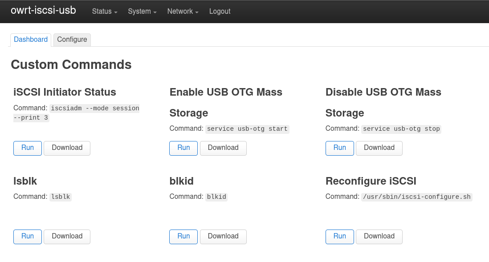

# openwrt-rpi4-iscsi-to-usb-bridge

## Overview

This repository contains a preconfigured Raspberry Pi 4 image that functions as an iSCSI-to-USB bridge by connecting to an iSCSI Target block device and sharing it as regular USB Mass Storage through the USB-C OTG port.

This is useful when you have iSCSI Targets running on a network and want to access the storage from a device that supports USB storage but has no network connectivity or iSCSI Initiator support.


## Requirements

* A Raspberry Pi 4 B.

  * For other devices with USB OTG/device-mode that are supported by OpenWrt, you can adjust [`Makefile`](Makefile) and [`/etc/uci-defaults/05-usb-otg`](rootfs/etc/uci-defaults/05-usb-otg), then follow the Build instructions below.

* A USB-A to USB Type-C cable.

* An iSCSI Target server available over Ethernet.


## Installing

Download a disk image from the releases, flash it to an SD card and boot it in your Raspberry Pi 4.


## Usage

### Configuring

By default a Wireless SSID network is created called `owrt-iscsi-usb` that you can connect to and access the admin UI on <http://192.168.1.1> or via `ssh 192.168.1.1`.

You can change the network settings for the Ethernet connection using the OpenWrt Admin UI.




### iSCSI-to-USB bridge

When booted:

* `/etc/init.d/open-iscsi` iSCSI initiator will automatically connect to the previously configured iSCSI targets in [`/etc/iscsi`](rootfs/etc/iscsi).
* [`/etc/init.d/usb-otg`](rootfs/etc/init.d/usb-otg) will find all iSCSI block devices and register them with the `g_mass_storage` USB Gadget Mass Storage driver.

So if the Pi is plugged via the USB-C OTG connector into the USB port of another computer, after a few seconds of powering up the iSCSI target block devices will automatically appear to the computer as USB Mass Storage.

To connect to a different iSCSI Target, modify [`/usr/sbin/iscsi-configure.sh`](rootfs/usr/sbin/iscsi-configure.sh) and re-run the script, which will replace the current settings in [`/etc/iscsi`](rootfs/etc/iscsi).


### USB-to-iSCSI bridge or iSCSI-to-iSCSI proxy

An iSCSI Target server `/etc/init.d/tgt` is also included which can be used to share locally attached storage via iSCSI. This is disabled by default. It can be configured by:

* Edit [`/etc/config/tgt`](rootfs/etc/uci-defaults/90-tgt)
* Start the service with `/etc/init.d/tgt enable; /etc/init.d/tgt start`.


## Performance

Benchmark setup:

* Hardware: Raspberry Pi 4 B Rev 1.4, 8 GB.
* iSCSI Target: `tgtd` in KVM, virtio storage backed by SSD.
* Ethernet: 1 GB/s (iperf3 test: 943 MB/s)
* USB: 3.0.

Results:

* Throughput: ~41 MB/s.
* Latency 0.6 ms.


## Building

### Debian

```
sudo make deps-debian
make images 
```


## Reference

[iscsiadm(8)](https://linux.die.net/man/8/iscsiadm).

[g_mass_storage](https://www.kernel.org/doc/html/latest/usb/mass-storage.html).

[OpenWrt - Raspberry Pi](https://openwrt.org/toh/raspberry_pi_foundation/raspberry_pi).

[OpenWrt - USB Guest Configuration](https://openwrt.org/docs/guide-user/hardware/usb_gadget).

[OpenWrt - Image Builder](https://openwrt.org/docs/guide-user/additional-software/imagebuilder).


## Author

Copyright (C) 2022 Joseph Mullally

License: [GPLv2](./LICENCE.txt)

Project: <https://github.com/jwmullally/openwrt-rpi4-iscsi-to-usb-bridge>
